# Omar Al-Mubaidin
### Full-Stack Engineer · Amman, Jordan 🇯🇴

*I build fast, secure, and scalable digital products with strong UI, real-world usefulness, and clean engineering.*

---

## 👋 Introduction

I’m Omar, a Computer Science student at Hussein Technical University and a full-stack developer from Amman focused on building products that are useful, performant, and polished.

My main interests are web engineering, UI/UX design, backend systems, and security-focused software. I like shipping quickly, learning by building, and improving every project through iteration.

---

## 🎯 Focus

This profile is built for recruiters, collaborators, founders, and developers who want to quickly understand what I build and how I think.

I’m especially interested in full-stack product development, educational tools, secure apps, and systems that solve real problems rather than demo-only ideas.

---

## 💫 About Me

I care about clean architecture, sharp interface design, and software that feels reliable in the real world.

- 🚀 Creator of **[HTUAI](https://github.com/Omarmubx7/htuai)** — an AI-powered course tracker for HTU students
- 🤖 Built **[mubxbot](https://github.com/Omarmubx7/mubxbot)** — a JavaScript-based automation and bot project
- 🏅 Built projects through hackathons and fast delivery environments, including **[pwc-hackathon](https://github.com/Omarmubx7/pwc-hackathon)**
- 📐 Strong interest in UI/UX, product structure, and frontend clarity
- 🔐 Interested in secure systems and trustworthy user experiences
- ⚡ Always building, testing, and learning something new

---

## 🚀 Featured Projects

| Project | What it is | Stack |
|---------|------------|-------|
| [**HTUAI**](https://github.com/Omarmubx7/htuai) | AI-powered course tracker for HTU students | TypeScript, Next.js |
| [**mubxbot**](https://github.com/Omarmubx7/mubxbot) | Automation and bot-based experimentation project | JavaScript |
| [**java-projects**](https://github.com/Omarmubx7/java-projects) | Practice and implementation of data structures and algorithms | Java |
| [**htu_martial_arts-man**](https://github.com/Omarmubx7/htu_martial_arts-man) | Martial arts management project for HTU | PHP ||

---

## 🛠️ Tech Stack

### Languages

### Frontend

### Backend & APIs

### Databases

### Cloud, DevOps, and Tools

---

## 📊 GitHub Stats

 

---

## 📫 Contact

The fastest way to reach me is through [LinkedIn](https://linkedin.com/in/omarmubaidin), [Instagram](https://instagram.com/mubx.dev), or [email](mailto:omarmubaidin@proton.me).

You can also find my links and work hub at [mubx.dev/links](https://mubx.dev/links).

---

*Ship it, then iterate.*

